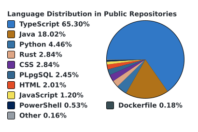

<h1 align="center">Hi, I'm Lorenzo Vicino</h1>
<h3 align="center">Backend engineer from Italy — Java, Spring, C# and .NET</h3>

I work on the **[GTFleet 365](https://gtfleet365.it/)** platform.

Outside work I'm building **[ludus](https://github.com/LorenzoVicino/ludus)**, a UCI chess engine in
Java, in two acts: a classical engine first, then a neural network evaluation replacing it. Every
improvement is measured by an SPRT match against the previous version rather than claimed — including
one patch that measured at nothing and got thrown out. The status page below keeps its own score.

I'm fond of design patterns to the point of [reading about them for
fun](https://refactoring.guru/). ludus is where I find out which ones actually earn their place.

  <a href="https://lorenzovicino.github.io/ludus/">
    <picture>
      <source media="(prefers-color-scheme: dark)"
              srcset="https://raw.githubusercontent.com/LorenzoVicino/ludus/main/docs/card-dark.svg">
      
    </picture>
  </a>

<h3 align="left">Connect with me:</h3>

<ul>
  <li>
    <a href="https://www.linkedin.com/in/lorenzo-vicino">
      LinkedIn
    </a>
  </li>
  <li>
    <a href="mailto:imlorenzovicino@gmail.com">
      imlorenzovicino@gmail.com
    </a>
  </li>
</ul>

<h3 align="left">Languages and Tools:</h3>

               

<h3 align="left">Most Used Languages:</h3>

  <picture>
    <source media="(prefers-color-scheme: dark)" srcset="./images/languages-dark.svg">
    <source media="(prefers-color-scheme: light)" srcset="./images/languages-light.svg">
    
  </picture>

